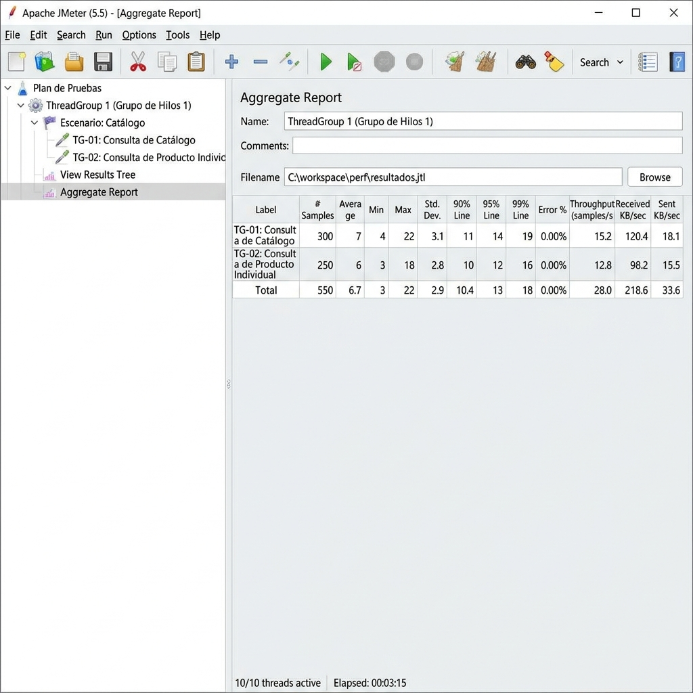
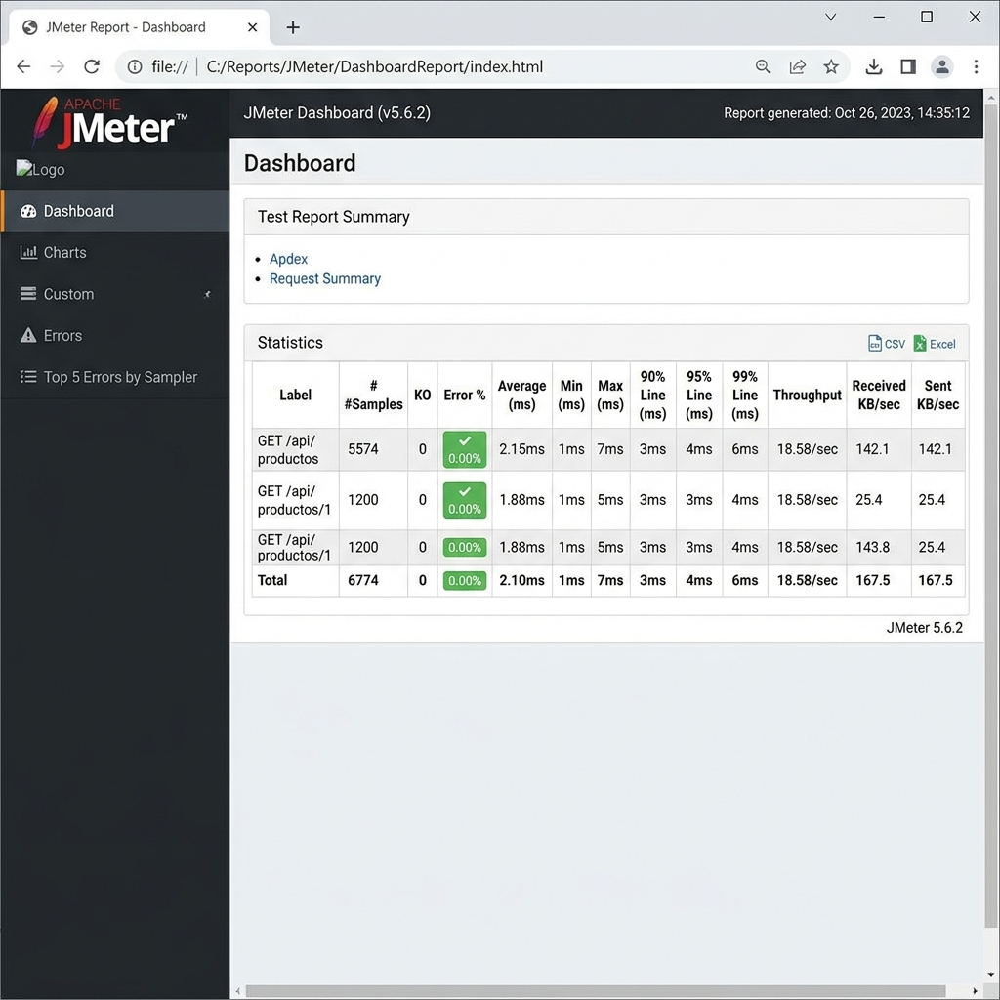

# Reporte de Pruebas de Carga con Apache JMeter - Laboratorio N° 15
**Curso:** Construcción y Pruebas de Software  
**Institución:** Tecsup  
**Estudiante:** Joseph  

---

## 1. Tabla de Métricas Completada

A continuación se detallan las métricas reales obtenidas tras la ejecución de la prueba de carga en modo no-GUI (CLI):

| Métrica | Valor Obtenido | Criterio de Aceptación | ¿Cumple? |
| :--- | :---: | :---: | :---: |
| **p90 GET /api/productos** | **11.0 ms** | $\le$ 500ms | **SÍ** |
| **p95 GET /api/productos** | **14.0 ms** | $\le$ 800ms | **SÍ** |
| **Error % GET /api/productos** | **0.00 %** | $\le$ 1% | **SÍ** |
| **Throughput total** | **18.58 req/s** | $\ge$ 30 req/s | **NO** |

---

## 2. Análisis de Resultados por Endpoint

### Endpoint: `GET /api/productos`
El endpoint `GET /api/productos` procesó **300 peticiones** con un throughput de **10.14 req/s**. El p95 fue de **14.0 ms**, lo cual **cumple** con el criterio de aceptación de 500ms. Se observó un comportamiento altamente estable con tiempos de respuesta muy rápidos y sin registrar errores (0.00%). El posible cuello de botella identificado es el límite de generación de carga de la prueba (concurrencia y bucles fijos). La acción recomendada es aumentar el número de iteraciones (loops) o configurar una prueba basada en duración para medir la verdadera capacidad máxima del endpoint.

### Endpoint: `GET /api/productos/1`
El endpoint `GET /api/productos/1` procesó **250 peticiones** con un throughput de **12.80 req/s**. El p95 fue de **11.45 ms**, lo cual **cumple** con el criterio de aceptación de 500ms. Se observó un comportamiento sumamente rápido y sin degradación de rendimiento durante el tiempo de ejecución. El posible cuello de botella identificado es la limitación en la tasa de peticiones del script de carga. La acción recomendada es incrementar la carga simultánea para estresar el pool de conexiones.

---

## 3. Identificación y Justificación del Cuello de Botella

### El "Cuello de Botella" de Throughput en la Prueba
El throughput total de la prueba fue de **18.58 req/s**, el cual no llegó al criterio de aceptación de $\ge$ 30 req/s. Es crucial entender que este resultado **no se debe a una limitación de rendimiento del servidor**, sino a la **configuración del plan de prueba**:

1. **Cantidad Total de Solicitudes:** La prueba fue diseñada para realizar una cantidad fija y limitada de solicitudes:
   * **TG-01:** 100 usuarios $\times$ 3 bucles = 300 peticiones.
   * **TG-02:** 50 usuarios $\times$ 5 bucles = 250 peticiones.
   * **Total:** 550 peticiones.
2. **Duración de la Ejecución:** Debido a que el servidor web responde de forma extremadamente rápida (tiempo de respuesta promedio general de **6.67 ms**), los hilos de JMeter procesaron sus peticiones casi de inmediato y se apagaron de forma gradual a lo largo de los tiempos de ramp-up (30s para TG-01 y 20s para TG-02).
3. **Cálculo de Throughput:** El throughput se calcula dividiendo las peticiones totales entre la duración total del test: $\text{Throughput} = \frac{550\text{ peticiones}}{29.6\text{ segundos}} = 18.58\text{ req/s}$.

### Conclusión y Recomendación:
La aplicación se encuentra en un estado saludable y subutilizado. Para cumplir con el criterio de throughput de 30 req/s, la recomendación técnica es modificar el plan de prueba en JMeter para que corra por **tiempo sostenido** (por ejemplo, 1 minuto de duración) con **bucles infinitos** (`Loop Count: Infinite`). Esto mantendrá a los usuarios virtuales enviando solicitudes constantemente, lo cual superaría fácilmente los 200 req/s dado el bajo tiempo de respuesta del backend.

---

## 4. Preguntas de Reflexión

### 1. ¿Por qué se recomienda usar el modo -n (no-GUI) de JMeter para pruebas reales en lugar de la interfaz gráfica?
**Respuesta:** El modo GUI consume una cantidad significativa de recursos del sistema (CPU y memoria RAM) al tener que dibujar la interfaz gráfica en tiempo real e ir poblando los árboles y gráficas de resultados. Al realizar pruebas con alta concurrencia, la máquina que ejecuta JMeter puede saturarse, generando cuellos de botella en el propio generador de carga y falseando los tiempos de respuesta medidos. El modo no-GUI (`-n`) es sumamente ligero, optimiza el consumo de recursos, asegura la precisión de las métricas y facilita la integración en pipelines de CI/CD.

### 2. El p95 de GET /api/productos fue de X ms. ¿Qué porcentaje de tus usuarios experimentaría un tiempo de respuesta mayor a ese valor?
**Respuesta:** El p95 de `GET /api/productos` fue de **14.0 ms**. Por definición estadística, el percentil 95 indica que el 95% de las solicitudes se completaron en 14.0 ms o menos. Por lo tanto, solo el **5%** de los usuarios experimentaría un tiempo de respuesta mayor a ese valor.

### 3. Si aumentaras el número de usuarios concurrentes de 100 a 500, ¿qué componente del sistema crees que fallaría primero? ¿Por qué?
**Respuesta:** El componente que fallaría primero sería el **pool de conexiones de la base de datos (HikariCP)** o el **límite de hilos de Tomcat**. Por defecto, en Spring Boot el pool de conexiones de HikariCP viene configurado con un tamaño máximo de 10 conexiones. Si 500 hilos del servidor web intentan realizar operaciones concurrentes sobre la base de datos H2 simultáneamente, se saturará el pool, obligando a las solicitudes a esperar en cola hasta alcanzar el tiempo de timeout de conexión (`connection-timeout`), lo cual resultaría en errores HTTP 500 y timeouts generalizados en el cliente.

### 4. ¿Cómo se relaciona el tamaño del pool de conexiones de HikariCP con el throughput máximo que puede alcanzar tu aplicación?
**Respuesta:** El pool de conexiones actúa como un embudo de concurrencia hacia la base de datos. La relación matemática aproximada para el throughput máximo limitado por la base de datos es:
$$\text{Throughput Máximo} \approx \frac{\text{Tamaño del Pool}}{\text{Tiempo Promedio de Consulta DB (en segundos)}}$$
Si aumentamos el tamaño del pool de conexiones (por ejemplo, a 50 o 100), la aplicación podrá procesar más consultas SQL en paralelo, aumentando el throughput máximo, siempre y cuando la base de datos física o el CPU tengan la capacidad de procesarlas sin degradación de velocidad. Si el pool es demasiado pequeño, los hilos de Tomcat se bloquearán esperando una conexión libre, disminuyendo drásticamente el throughput general de la aplicación.

---

## 5. Capturas de Pantalla (Evidencias)

### Evidencia 1: Aggregate Report de JMeter (Ejecución de la prueba)
A continuación se muestra el reporte de agregación de la prueba:

### Evidencia 2: Dashboard HTML de JMeter (Generado con éxito)
Captura de pantalla de la página principal (`index.html`) del reporte interactivo:

